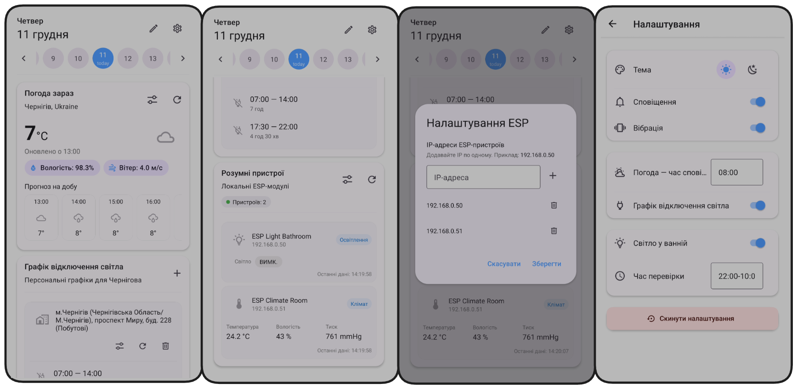
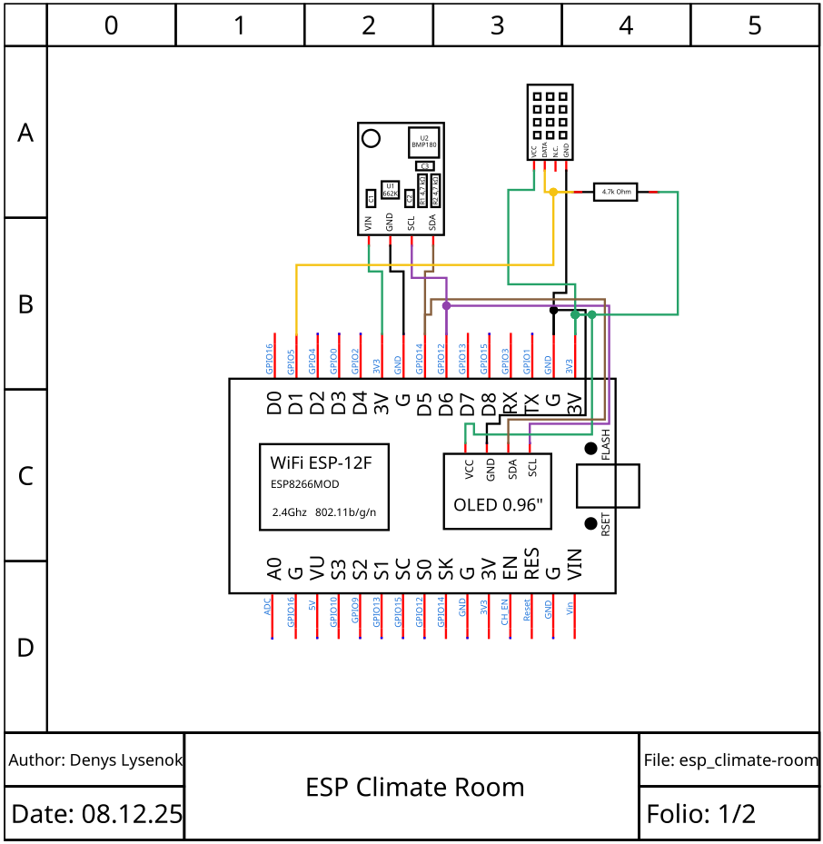
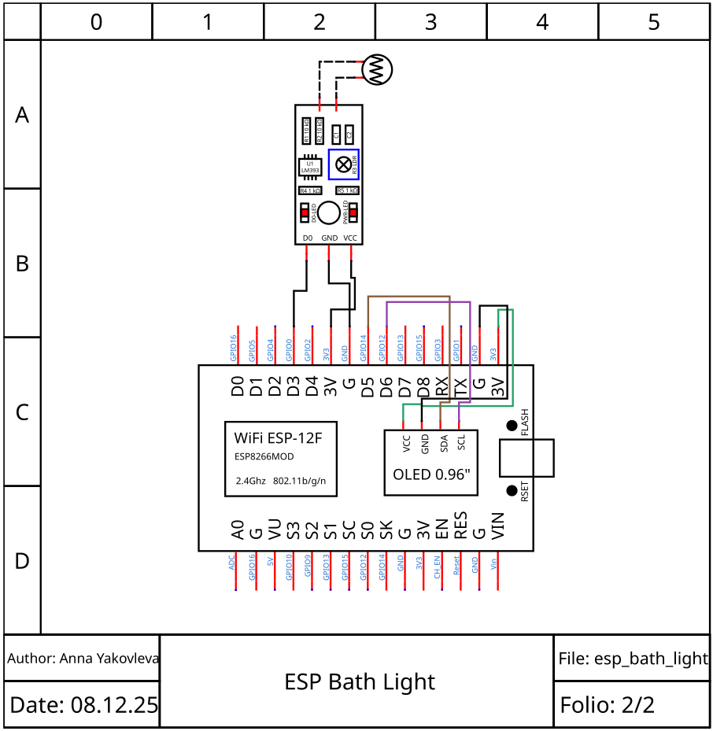
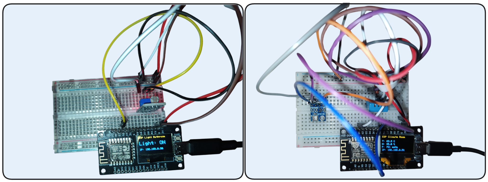
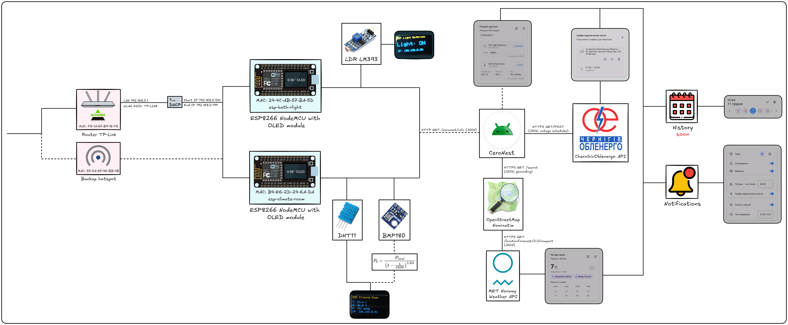

**Local-first smart home system designed for unstable power grids.**

CeroNest is a React Native mobile app paired with ESP8266-based sensors that monitors indoor climate, tracks bathroom light status, and displays power outage schedules. Built specifically for real-world conditions in Ukraine (Chernihiv), it prioritizes offline functionality and local network resilience.

## Features

- **Climate monitoring** via DHT11 + BMP180 sensors (temperature, humidity, pressure)
- **Light detection** using LM393 photoresistor module
- **Power outage schedules** from local utility provider with offline caching
- **Weather forecasts** with automatic local fallback
- **Smart notifications** for weather, outages, and forgotten lights
- **Dual WiFi support** on ESP devices (automatic failover to phone hotspot)
- **Works offline** — all critical data cached locally

## Screenshots

### Mobile App


### Hardware
| ESP Climate Room | ESP Bath Light |
|-----------------|----------------|
|  |  |



## Architecture



**Data flow:**
1. ESP devices expose HTTP endpoint: `GET /ceronest/info`
2. Mobile app polls configured IPs, normalizes responses, stores snapshots
3. Weather fetched from MET Norway API, cached hourly
4. Power schedules fetched from Chernihivoblenergo, cached per address
5. All settings in AsyncStorage, history in local SQLite database

## Quick Start

### Mobile App

```bash
cd mobile
npm install
npm run android
```

### ESP Devices

1. Open `.ino` files in Arduino IDE or PlatformIO
2. Configure WiFi credentials:
   ```cpp
   #define WIFI_SSID "your_network"
   #define WIFI_PASS "your_password"
   #define WIFI_SSID_BACKUP "phone_hotspot"  // fallback
   #define WIFI_PASS_BACKUP "hotspot_pass"
   ```
3. Flash to NodeMCU
4. Note the IP shown on OLED display

## Hardware Setup

### ESP Climate Room
**Components:**
- NodeMCU ESP8266
- DHT11 (temperature/humidity)
- BMP180 (barometric pressure)
- 0.96" OLED I2C (SSD1306)

**Wiring:**
- OLED: SDA → D5 (GPIO14), SCL → D6 (GPIO12)
- DHT11: DATA → D1 (GPIO5), VCC → 3.3V, GND → GND
    - **Requires 4.7k resistor** on DATA line
- BMP180: Shares I2C with OLED (SDA/SCL)

**Code:** `esp/esp-climate-room/esp-climate-room.ino`

### ESP Bath Light
**Components:**
- NodeMCU ESP8266
- LM393 LDR module (digital output)
- 0.96" OLED I2C (SSD1306)

**Wiring:**
- OLED: SDA → D5 (GPIO14), SCL → D6 (GPIO12)
- LM393: DO → D3 (GPIO0), VCC → 3.3V, GND → GND

**Code:** `esp/esp-bath-light/esp-bath-light.ino`

## API Reference

### ESP Device Endpoint

**Request:**
```http
GET http://192.168.0.51/ceronest/info
```

**Climate response:**
```json
{
  "id": "esp-climate-room",
  "name": "ESP Climate Room",
  "sensors": {
    "temperature": 23.4,
    "humidity": 46.0,
    "pressure": 761.0
  }
}
```

**Light response:**
```json
{
  "id": "esp-light-bathroom",
  "name": "ESP Light Bathroom",
  "sensors": {
    "light": 1
  }
}
```

### External APIs

**Weather** — MET Norway Locationforecast 2.0
```
https://api.met.no/weatherapi/locationforecast/2.0/compact
```
[Documentation](https://api.met.no/weatherapi/locationforecast/2.0/documentation)

**City Search** — OpenStreetMap Nominatim
```
https://nominatim.openstreetmap.org/search
```
[Documentation](https://nominatim.org/release-docs/latest/api/Search/)

**Power Schedules** — Chernihivoblenergo
```
https://chernihivoblenergo.com.ua/power_outages
```

## Key Components

**Dashboard** (`mobile/src/screens/DashboardScreen.tsx`)
- Customizable block order (persisted locally)
- Date selection via `DayStrip.tsx`

**Weather** (`mobile/src/components/WeatherBlock.tsx`)
- Current conditions + hourly forecast
- Automatic offline fallback to cached data

**Power Schedules** (`mobile/src/services/powerScheduleApi.ts`)
- Multi-address support
- Local cache when provider unavailable
- Automatic next-outage notifications

**ESP Devices** (`mobile/src/services/espApi.ts`)
- Auto-detect device type (climate/light/unknown)
- Bathroom light reminder with time window + cooldown

**Notifications** (`mobile/src/services/notifications.ts`)
- Daily weather at configurable time (default 08:00)
- Power outage alerts (15 min before)
- Smart light reminders (rate-limited)

## Data Storage

**AsyncStorage** — Settings and UI state
- Theme, notification preferences
- Block order, weather location
- Saved addresses, ESP IPs

**SQLite** — Historical data _(Soon)_
- Weather hourly points
- Power schedules
- ESP samples and daily aggregates

Bridge: `mobile/src/services/nativeStats.ts`

## Offline Behavior

- **Weather**: Falls back to cached hourly data if API fails; past dates always use cache
- **Power schedules**: Shows cached schedule when provider unreachable
- **ESP devices**: Requires local WiFi (no internet needed)
- **Network detection**: `mobile/src/services/network.ts`

## License

MIT License — see [LICENSE](LICENSE)